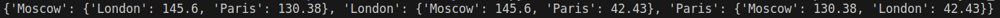
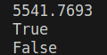
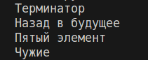
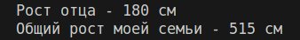
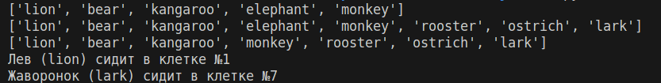
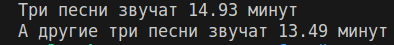
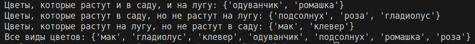
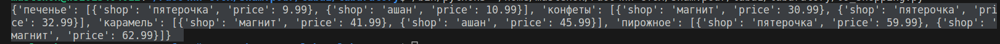
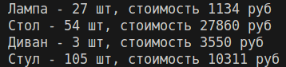

# Отчёт по лабораторной работе №1

## Задание 00

Разработать программу на Python, которая вычисляет расстояния между различными городами на основе их координат, представляя их в виде пар чисел (x, y). Формула Евклидова расстояния для двумерных пространств используется для расчёта расстояний. 

## Описание проделанной работы

1. **Метод расчёта**: Для вычисления расстояния между двумя точками на плоскости применяется формула Евклидова расстояния:

$$ d = \sqrt{(x_1 - x_2)^2 + (y_1 - y_2)^2}. $$

   где $x_1$, $y_1$ и $x_2$, $y_2$ — координаты первой и второй точки соответственно.

2. **Представление данных**: Результаты округляются до двух знаков после запятой для повышения читабельности.

## Результаты выполнения программы

_______

## Задание 01

Разработать программу на Python, которая вычисляет площадь круга и проверяет принадлежность точек к этому кругу. Центр круга находится в начале координат (0, 0).

## Описание проделанной работы

1. **Расчёт площади круга**: Для вычисления площади круга использована формула:

$$ S = \pi r^2, $$

2. **Проверка принадлежности точки к кругу**: Для определения, находится ли точка внутри круга, вычислено расстояние от точки до начала координат (центра круга) по формуле:

$$ d = \sqrt{x^2 + y^2}, $$
## Результаты выполнения программы

На выходе получены следующие результаты:

___
## Задание 02
## Описание проделанной работы

1. **Анализ задачи**: Задача сводится к поиску такой комбинации арифметических операций, при которой результат выражения будет равен 25. 

2. **Подбор решения**: Были рассмотрены различные варианты расстановки операций.

Таким образом, правильная формула выглядит так:

$$ (1 + 2 + 3 + 4 + 5) * 10 - 100 = 25 $$

## Результаты выполнения программы

___

## Задание 03

Вывести на консоль фильмы из строки `my_favorite_movies`, используя индексирование строки. 
## Описание проделанной работы

1. **Индексирование строки**: Для получения нужных фрагментов строки использовались срезы, основываясь на известных позициях начала и конца каждого фильма в строке.

2. **Получение последнего фильма**: Используется отрицательная индексация для выбора символов с конца строки.

3. **Получение второго с конца фильма**: Также используется отрицательная индексация для выбора символов с конца строки.

## Результаты выполнения программы

___

## Задание 04

Создать два списка: один с именами членов семьи, другой со списком списков, содержащими имена и рост членов семьи. Вывести на консоль рост отца и общую сумму ростов всех членов семьи.

## Описание проделанной работы

1. **Создание списков**: Были созданы два списка: `my_family` для хранения имен членов семьи и `my_family_height` для хранения пар «имя-рост».

2. **Поиск роста отца**: Использовался генератор выражений для поиска роста члена семьи с именем "Отец".

3. **Суммирование общего роста**: Применена функция `sum()` для суммирования всех элементов списка ростов.

## Результаты выполнения программы

___

## Задание 05

Изменить список животных в зоопарке `zoo`: добавить медведя между львом и кенгуру, добавить птиц из списка `birds` в конец списка, убрать слона и вывести информацию о клетках, в которых сидят лев и жаворонок.

## Описание проделанной работы

1. **Добавление медведя**: Используем метод `insert()` для вставки медведя между львом и кенгуру.

2. **Добавление птиц**: Метод `extend()` позволяет добавить элементы одного списка в конец другого.

3. **Удаление слона**: Метод `remove()` удаляет первое вхождение указанного элемента из списка.

4. **Определение номеров клеток**: Методом `index()` находим индексы льва и жаворонка, прибавляем единицу для соответствия человеческому счету (начиная с единицы).

## Результаты выполнения программы

___

## Задание 06

Рассчитать общее время звучания трёх песен из списка `violator_songs_list` и трёх песен из словаря `violator_songs_dict`.

## Описание проделанной работы

1. **Работа со списком**: Для нахождения времени звучания песен из списка `violator_songs_list` использовался генератор выражений для фильтрации нужных песен по названию и извлечения их длительности.

2. **Работа со словарем**: Для нахождения времени звучания песен из словаря `violator_songs_dict` применялся метод `get()`, позволяющий безопасно получать значения по ключам.

3. **Округление**: Для форматированного вывода времени использовалось округление до двух знаков после запятой с помощью формата `{value:.2f}` в функции `print()`.

## Результаты выполнения программы

___

## Задание 07

Расшифровать зашифрованное сообщение, состоящее из пяти слов, и вывести его на консоль в удобочитаемом виде.

## Описание проделанной работы

1. **Ключ к шифру**: Каждое слово сообщения закодировано разными частями строки. Для расшифровки нужно выбрать определенные символы из каждой строки в соответствии с инструкцией.

2. **Расшифровка**: Для каждого слова были определены нужные индексы символов, которые формируют расшифрованную часть слова. Для некоторых слов требовалось взять символы в обратном порядке.

## Результаты выполнения программы

___

## Задание 08

Определить множества цветов, растущих в саду и на лугу, найти пересечения и различия между этими множествами.

## Описание проделанной работы

1. **Множества цветов**:
   - Для определения уникальных видов цветов, растущих в саду и на лугу, использованы множества `set()`.
   - Множество `garden_set` представляет уникальные цветы, растущие в саду.
   - Множество `meadow_set` представляет уникальные цветы, растущие на лугу.

2. **Пересечение множеств**:
   - Пересечение множеств `garden_set` и `meadow_set` определяет виды цветов, которые встречаются и в саду, и на лугу.

## Результаты выполнения программы

___

## Задание 09

Создать словарь с информацией о ценах на товары в различных магазинах, выбрать для каждого товара два магазина с минимальными ценами.

## Описание проделанной работы

1. **Структура данных**:
   - Использован словарь `shops`, представляющий собой структуру, содержащую информацию о магазинах и товарах с их ценами.
   - Каждый элемент словаря `shops` является списком товаров, каждый товар представлен в виде словаря с ключами `name` (название товара) и `price` (цена).

2. **Обработка данных**:
   - Из словаря `shops` извлекаются данные о каждом товаре и магазине.
   - Для каждого товара создается отдельный словарь `sweets`, куда заносятся пары "магазин-цена".
   - Выполняется сортировка по цене для каждого товара, после чего выбираются два магазина с минимальными ценами.

## Результаты выполнения программы

___

## Задание 10

Рассчитать общую стоимость каждого вида товара на складе.

## Описание проделанной работы

1. **Данные о товарах и складах**:
   - Использованы два словаря: `goods` для соответствия названий товаров их кодам и `store` для хранения информации о количестве и стоимости товаров на складе.

2. **Расчет общей стоимости**:
   - Для каждого товара сначала определяется его код через словарь `goods`.
   - Далее из словаря `store` извлекается информация о количестве и цене товара.
   - Общая стоимость рассчитывается путем умножения общего количества товара на его цену.

## Результаты выполнения программы

# Шпаргалка по GitHub
## Чтобы скопировать
git clone (ссылка на репозиторий)

## Чтобы добавить в GitHub код с устройства
git add
git status
git commit -m(комментарий)
git push (название репозитроия)