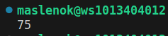
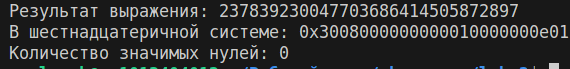
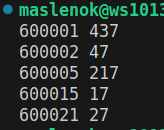

# Задание 1
## Условие
Игорь составляет таблицу кодовых слов для передачи сообщений, каждому сообщению соответствует своё кодовое слово. В качестве кодовых слов Игорь использует трёхбуквенные слова, в которых могут быть только буквы Ш, К, О, Л, А, причём буква К появляется ровно 1 раз. Каждая из других допустимых букв может встречаться в кодовом слове любое количество раз или не встречаться совсем. Сколько различных кодовых слов может использовать Игорь?
## Описание проделанной работы
1. **Определение позиций для буквы К**: Буква К может находиться на одной из трех позиций — первой, второй или третьей. 
2. **Заполнение остальных двух позиций**: После выбора позиции для буквы К, остальные две позиции могут быть заполнены любой из оставшихся пяти букв (Ш, О, Л, А).
3. **Подсчет общего количества комбинаций**: Умножил количество вариантов на количество способов заполнения каждой из оставшихся позиций. 
## Скриншоты результатов

"""
# ЗАДАНИЕ 2

## Условия задачи

Заданое арифметическое выражение:

$$3 \cdot 4^{48} + 2 \cdot 4^{43} + 4^{20} + 3 \cdot 4^5 + 2 \cdot 4^4 + 1$$

Необходимо перевести результат этого выражения в шестнадцатеричную систему счисления и определить количество значимых нулей в полученной записи.

## Описание проделанной работы

Для решения задачи выполнили следующие шаги:

1. Рассчитал значение арифметического выражения.
2. Перевел полученное число в шестнадцатеричную систему счисления.
3. Проверил наличие значимых нулей в шестнадцатеричной записи.

## Результаты

Программа выводит следующие данные:

# Задание 3

## Условие задачи

Перебирать целые числа, большие 600 000, в порядке возрастания и искать среди них такие, среди делителей которых есть хотя бы одно число, оканчивающееся на 7, но не равное 7 и самому числу. Нужно вывести первые 5 таких чисел и наименьший делитель, оканчивающийся на 7, не равный 7 и самому числу.

## Описание решения

1. **Начало перебора чисел:**
   - Начинаем с числа 600001 и последовательно увеличиваем его на 1.

2. **Поиск делителей:**
   - Для каждого числа находим делители, оканчивающиеся на 7.
   - Делители ищутся с использованием цикла, начиная с 17 (первое число, большее 7 и оканчивающееся на 7), с шагом 10.

3. **Выбор валидных делителей:**
   - Среди найденных делителей выбираются те, которые больше 7 и не равны самому числу.

## Пример вывода

