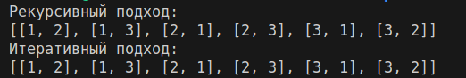

# Отчёт по лабораторной работе №3

## Задание

Написать функцию для вычисления всех перестановок списка длиной k применяя рекурсию и без неё

## Описание проделанной работы

1. Если k == 0, она возвращает список, содержащий пустой список [], поскольку это базовый случай рекурсии.

2. Функция k_permutations_iterative использует стандартную функцию permutations из модуля itertools, которая автоматически генерирует все возможные перестановки длины k из заданного набора элементов.

## Результаты выполнения программы

## Источники

1. https://youtu.be/IJDJ0kBx2LM Recursion in Programming - Full Course - freeCodeCamp.org
2. https://proglib.io/p/samouchitel-po-python-dlya-nachinayushchih-chast-13-rekursivnye-funkcii-2023-01-23 Самоучитель по Python для начинающих. Часть 13: Рекурсивные функции - proglib.io
_______
