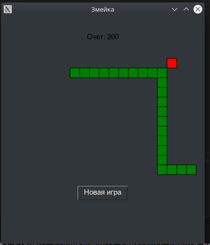

# Лабораторная работа 8

## Описание 
Реализуйте приложение с GUI (приложения-игры допускается делать с использованием TUI-пакетов) по своему варианту. Можно изменить задание на собственную тему, согласовав с преподавателем. Требования:

приложение должно быть написано с применением ОО парадигмы
исключительные ситуации должны обрабатываться с использованием собственных исключений
GUI/TUI фреймворки не должны повторяться в группе

## Решение

1. Основные компоненты:

Класс Snake (Змейка)

Хранит тело змейки как список координат

Управляет направлением движения (вверх/вниз/влево/вправо)

Реализует:

Движение (move())

Изменение направления (change_direction())

Проверку съедания еды (check_food_collision())

Отрисовку (draw())

Класс Food (Еда)

Генерирует случайное положение на поле

Избегает появления на теле змейки

Отрисовывается как красный квадрат

Класс SnakeGame (Игровой движок)

Управляет всем игровым процессом

Создает графический интерфейс

Обрабатывает:

Нажатия клавиш (управление)

Столкновения

Подсчет очков

Увеличение скорости игры

2. Особенности реализации:

Поле: 20x20 клеток (размер клетки - 20 пикселей)

Управление: стрелками клавиатуры

Механика:

Змейка растет при поедании еды

Игра ускоряется по мере набора очков

При столкновении с границами или собой - игра заканчивается

3. ООП-принципы:

Инкапсуляция:

Каждый класс содержит свои данные и методы работы с ними

Например, Snake скрывает внутреннее представление тела змейки

Наследование исключений:

Все игровые исключения наследуются от базового SnakeGameException

4. Графический интерфейс:

Библиотека appJar

Основные элементы:

Холст для отрисовки игры

Метка с текущим счетом

Кнопка "Новая игра"

5. Игровой цикл:

Обновление состояния игры происходит каждые N миллисекунд

При каждом обновлении:

Двигается змейка

Проверяются столкновения

Перерисовывается игровое поле

6. Обработка ошибок:

Собственные исключения для:

Столкновений (CollisionException)

Некорректного направления (InvalidDirectionException)
## Скриншот

# Справочные материалы

Подробное объяснение кода игры "Змейка" (20x20)
1. Структура проекта
Код разделен на несколько классов, каждый из которых отвечает за свою часть функционала:

Исключения (Custom Exceptions)

Направления движения (Enum Direction)

Класс Змейки (Snake)

Класс Еды (Food)

Основной игровой класс (SnakeGame)

2. Исключения (Custom Exceptions)
python
class SnakeGameException(Exception):
    """Базовое исключение для игры Змейка"""
    pass

class CollisionException(SnakeGameException):
    """Исключение при столкновении"""
    pass

class InvalidDirectionException(SnakeGameException):
    """Исключение при недопустимом направлении"""
    pass
Назначение: Обработка ошибок в игре.

Термины:

Базовое исключение (SnakeGameException) — родительский класс для всех исключений игры.

Столкновение (CollisionException) — возникает, когда змейка врезается в стену или себя.

Недопустимое направление (InvalidDirectionException) — если попытаться развернуть змейку на 180° (например, при движении вправо — резко влево).

3. Направления движения (Enum Direction)
python
class Direction(Enum):
    UP = 0
    RIGHT = 1
    DOWN = 2
    LEFT = 3
Назначение: Хранение возможных направлений движения змейки.

Термины:

Enum — перечисление, удобный способ хранить константы (UP, RIGHT, DOWN, LEFT).

UP/DOWN/LEFT/RIGHT — направления, каждое имеет числовое значение (0, 1, 2, 3).

4. Класс Змейки (Snake)
python
class Snake:
    def __init__(self, canvas_size, cell_size):
        self.cell_size = cell_size
        self.canvas_size = canvas_size
        self.reset()
Поля:

body — список координат сегментов змейки (голова — первый элемент).

direction — текущее направление.

next_direction — следующее направление (чтобы избежать резких разворотов).

grow — флаг, указывающий, должна ли змейка расти (после съедания еды).

Методы:
reset() — сбрасывает змейку в начальное состояние (3 сегмента по центру).

change_direction(new_direction) — меняет направление, запрещая разворот на 180°.

move() — двигает змейку вперед:

Добавляет новую голову в начало списка.

Если змейка не растет (grow = False), удаляет хвост.

check_food_collision(food) — проверяет, съела ли змейка еду (совпадение координат головы и еды).

draw(app) — отрисовывает змейку на холсте (зеленые квадраты).

5. Класс Еды (Food)
python
class Food:
    def __init__(self, canvas_size, cell_size):
        self.cell_size = cell_size
        self.canvas_size = canvas_size
        self.position = (0, 0)
        self.spawn()
Поля:

position — координаты еды (x, y).

Методы:
spawn(snake_body=None) — размещает еду в случайной позиции, избегая тела змейки.

draw(app) — отрисовывает еду (красный квадрат).

6. Основной игровой класс (SnakeGame)
python
class SnakeGame:
    def __init__(self, app, canvas_size=20, cell_size=20):
        self.app = app
        self.canvas_size = canvas_size
        self.cell_size = cell_size
        self.snake = Snake(canvas_size, cell_size)
        self.food = Food(canvas_size, cell_size)
        self.score = 0
        self.game_over = False
        self.speed = 200  # начальная скорость (меньше = быстрее)
Поля:

app — объект графического интерфейса (appJar).

snake — экземпляр змейки.

food — экземпляр еды.

score — текущий счет.

game_over — флаг окончания игры.

speed — задержка между ходами (в миллисекундах).

Методы:
setup_gui() — настраивает интерфейс:

Создает окно с холстом (Canvas).

Добавляет кнопку "Новая игра".

Привязывает клавиши управления (стрелки).

update() — игровой цикл:

Двигает змейку.

Проверяет столкновения.

Обновляет счет и скорость.

Перерисовывает игру.

reset_game() — сбрасывает игру в начальное состояние.

7. Графический интерфейс (appJar)
Окно игры:

Размер: 20x20 клеток, каждая 20x20 пикселей.

Заголовок: "Змейка".

Элементы:

Label — отображает текущий счет.

Canvas — игровое поле, где рисуются змейка и еда.

Button — кнопка "Новая игра".

Управление:

Стрелки клавиатуры (<Up>, <Down>, <Left>, <Right>).

8. Игровая логика
Движение змейки:

Каждые N миллисекунд змейка перемещается на 1 клетку.

Направление меняется при нажатии стрелок (но нельзя развернуться на 180°).

Съедание еды:

Если голова змейки попадает на клетку с едой:

Змейка растет (grow = True).

Еда появляется в новом месте.

Счет увеличивается на 10.

Столкновения:

Со стенами → CollisionException.

С собственным телом → CollisionException.

Скорость игры:

Увеличивается (уменьшается задержка speed) каждые 50 очков.

9. Запуск игры
python
app = gui()  # Создаем окно
game = SnakeGame(app)  # Создаем игру
app.go()  # Запускаем главный цикл
appJar автоматически обрабатывает события (нажатия кнопок, клавиш).

Игровой цикл работает через app.after(speed, update).

Итог
Это классическая "Змейка" с:

Объектно-ориентированным дизайном.

Обработкой ошибок через исключения.

Простым, но функциональным графическим интерфейсом.

Увеличивающейся сложностью (скорость растет со счетом).

1. Создание иерархии исключений
Класс SnakeGameException наследуется от стандартного Exception и становится родителем для всех кастомных исключений игры:
Это позволяет:
Группировать все игровые исключения под одним "зонтиком".
Легко отличать свои исключения от системных (например, ValueError).
2. Фильтрация исключений
Можно ловить только исключения игры, игнорируя другие:
3. Единая точка расширения
Если позже потребуется добавить общую логику для всех исключений игры (например, логирование), её можно поместить в базовый класс:
4. Чистота кода
Даже пустой класс улучшает читаемость:
Явно показывает намерение разработчика.
Делает код самоописываемым (видно, что это исключение именно для игры).
Почему не использовать Exception напрямую?
Если бы все исключения наследовались прямо от Exception:
Нельзя было бы отличить "игровые" ошибки от других.
Усложнилась бы фильтрация в блоках try/except.
Невозможно было бы добавить общую логику для всех исключений игры.
Итог:
SnakeGameException — это "метка" для всех исключений игры, даже если сейчас он пустой. Это хорошая практика для масштабируемости и поддержки кода.

# 2. Полиморфизм в переопределении методов
Если бы мы добавили подклассы для Snake с разным поведением (например, FastSnake и SlowSnake), они могли бы переопределять метод move():

python
class FastSnake(Snake):
    def move(self):
        super().move()  # Стандартное движение
        super().move()  # Двигается вдвое быстрее

class SlowSnake(Snake):
    def move(self):
        if random.random() > 0.5:  # Иногда пропускает ход
            super().move()
Что полиморфно:

Объекты FastSnake и SlowSnake могут использоваться вместо Snake, но с разным поведением метода move().

3. Полиморфизм в Direction (через Enum)
Перечисление Direction позволяет обрабатывать направления как единый тип, несмотря на разные значения:

python
def change_direction(self, new_direction):
    if new_direction == Direction.UP:    # Проверка через Enum
        ...
    elif new_direction == Direction.DOWN:
        ...
Что полиморфно:

Все направления (UP, DOWN и т.д.) обрабатываются через единый интерфейс Direction.

Итог:
Полиморфизм в этом коде используется для:

Обработки исключений через родительский класс.

Единообразной работы с направлениями (Enum).

